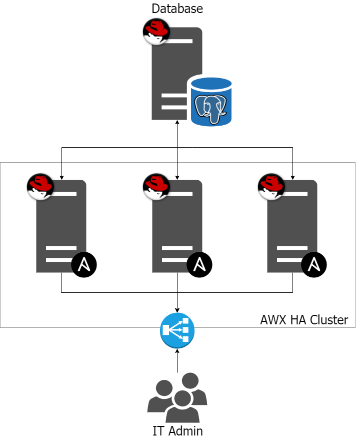

# AWX HA Cluster

[AWX](https://github.com/ansible/awx) is an upstream project of Ansible Tower. Commercial Ansible Tower comes with clustering functionality out of the box. More likely the same functionality can be achieved in AWX by tweaking few file modifications and settings. Ideas from  official Ansible Tower installation playbook and sub-reddits.

Why this repository ? For the needs of a client I had to configure an AWX cluster in HA. And rather than keeping everything to myself, you know me, open source remains open source, I share my work with you. The installation or configuration may still have problems. Do not hesitate to open issues so that I correct this.

## Official documentation

- [AWX Clustering](https://github.com/ansible/awx/blob/devel/docs/clustering.md)
- [Ansible Tower Clustering](https://docs.ansible.com/ansible-tower/latest/html/administration/clustering.html)

## AWX configuration and deployment

Compatible with AWX : 
- 14.0.0
- 14.1.0
- 15.0.0
- 15.1.0

### Dependencies

- CentOS 7, RedHat 7
- EPEL
- Ansible 2.9+
- Docker

### Target architecture

We need 3 AWX servers and 1 postgreSQL server, with ip adress and accessible by SSH. 

I recommend using a front-end proxy which will take care of the load balancing. (Traefik, Nginx ...), and have a domain name with SSL Let's encrypt. 
With Traefik you can configure a Load Balancer with Round-Robin. (I use this personally). I share with you my traefik settings (in traefik folder 🎉)



### Create your inventory

Create your own inventory as you can find in `inventory/awx_ha_server` (it is an example). Each node name must have variable `ansible_ssh_host` because this variable is use to add the appropriate new entry to `/etc/hosts` in container (mandatory for cluster communication at this time).

### Generate certificate for Nginx

Generate a SSL certificate. 

```bash
openssl genrsa -out server.key 2048
openssl req -sha256 -new -key server.key -out server.csr -subj '/CN=awx.example.lab'
openssl x509 -req -sha256 -days 365 -in server.csr -signkey server.key -out server.crt
cat server.crt server.key > server.pem
```

Next, copy `.pem` file in `roles/awx/files/server.pem`

### Configure your variables

You need to configure your extra-vars file. You can see template in `vars/awx_ha.yml`. All defaults variables can be found in each folder `default` in each roles

#### For Postgres External database

Write this variables in your extra-vars file like this (it's an example with an RDS Aurora Postgres compatible. Work fine)

```json
#### Postgres DB details
external_database: "yes"
pg_version: "10"
pg_hostname: "database-awx-instance-1.cauqtjatj3xu.eu-north-1.rds.amazonaws.com"
pg_password: "password"
pg_port: "5432"
pg_username: "awx"
pg_database: "database-awx-instance-1"
```

### Install

Check servers connections

```bash
ansible -m ping -i inventory/awx_ha_server all
```

Initialise AWX files and environement

```bash
ansible-playbook -i inventory/awx_ha_server -e @vars/my_awx_ha.yml -e task=setup awx.yml
```

Install Docker-CE and docker-compose

```bash
ansible-playbook -i inventory/awx_ha_server -e @vars/my_awx_ha.yml -e task=run awx.yml --skip-tags awx
```

Installation of the first node (wait for the end of the installation by following the logs on the first node)
This step is important because it will initialize the database

```bash
ansible-playbook -i inventory/awx_ha_server -e @vars/my_awx_ha.yml -e task=run --tags awx --limit awx01 awx.yml
```

We install and start the other nodes

```bash
ansible-playbook -i inventory/awx_ha_server -e @vars/my_awx_ha.yml awx.yml
```

### Upgrade

```bash
ansible-playbook -i inventory/awx_ha_server -e @vars/my_awx_ha.yml -e task=setup --tags awx awx.yml --diff
ansible-playbook -i inventory/awx_ha_server -e @vars/my_awx_ha.yml -e task=upgrade --tags awx awx.yml --diff
ansible-playbook -i inventory/awx_ha_server -e @vars/my_awx_ha.yml --tags awx awx.yml --diff
```

### Remove old Docker images

```bash
ansible -i inventory/awx_ha_server all -a "docker rmi awx_web_img_id awx_task_img_id"
```

### Performance Testing

Performance testing should be twofold:
- A large volume of simultaneous jobs
- Jobs that generate a large amount of output

These should also be benchmarked against the same playbooks using the 3.0.X Tower release and a stable Ansible version. For a large volume playbook (e.g., against 100+ hosts), something like the following is recommended:

https://gist.github.com/michelleperz/fe3a0eb4eda888221229730e34b28b89

## TODO
- [ ] Create AWX HA without SSL
- [ ] Automate the generation of the SSL key
- [ ] For dev only, add option to deploy AWX HA on a single server
- [ ] Enable "Isolated nodes" function [Understanding Ansible Tower Isolated Nodes](https://developers.redhat.com/blog/2017/12/20/understanding-ansible-tower-isolated-nodes/)
- [ ] Continue cleaning the original code [source](https://github.com/fitbeard/awx-ha-cluster)
